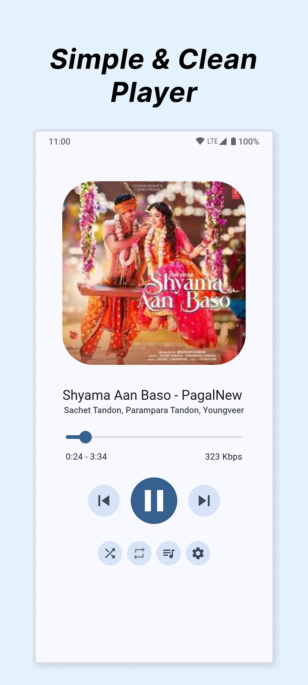
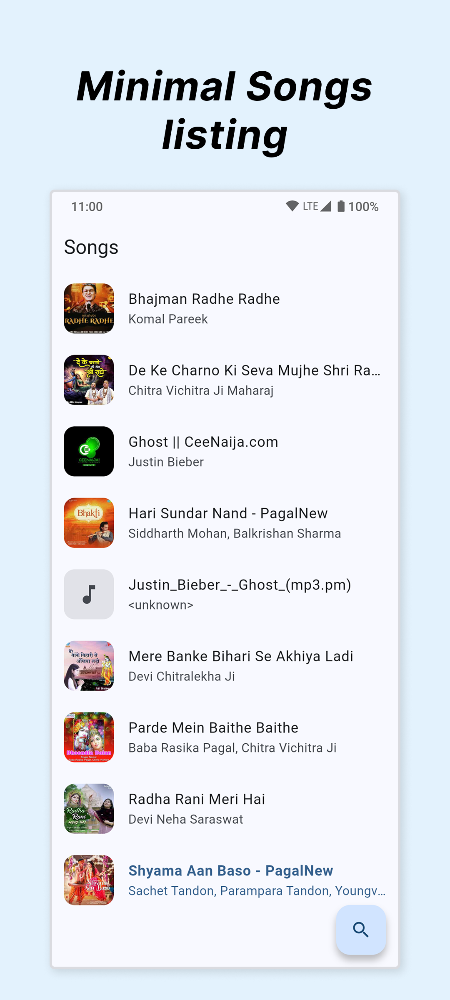
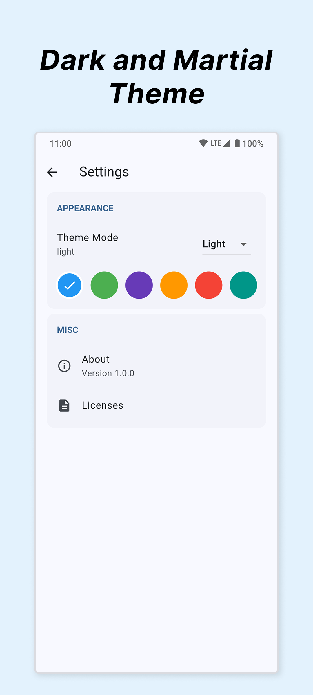

  

  <strong>Yet Another Music Player</strong> — a simple local music player for Android built with Flutter. 
  <em>Quite the features, and let only music play.</em>

## Links

- **Play Store:** [Download Yamp](https://play.google.com/store/apps/details?id=com.system74.yamp)
- **Source code:** [github.com/ankit792r/yamp](https://github.com/ankit792r/yamp)

## Features

- Play songs from your device library (offline)
- Clean Now Playing with album art, seek, and bitrate
- Browse songs with artwork, title, and artist
- Search songs and albums
- Queue, shuffle, and repeat (off / all / one)
- Background playback with lock-screen / notification controls
- Light, dark, and system themes with accent colors
- Restores last played track and position

## Screenshots

  
  &nbsp;
  
  &nbsp;
  

| | | |
|:---:|:---:|:---:|
| Now Playing | Songs library | Themes & accents |
